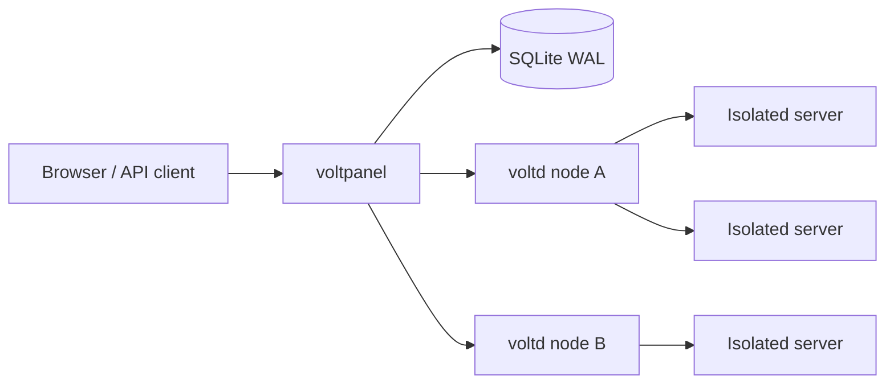

# VoltPanel

VoltPanel is a free, self-hosted Linux workload platform for games, websites, bots, and application services. It is designed around an original operational model rather than reproducing another hosting panel's screens or terminology.

- `voltpanel` — control plane, Pulse UI, Flow engine, placement, identity, and state
- `voltd` — execution agent for isolated workloads, storage, terminal streams, telemetry, Vault snapshots, and transfers

The platform uses SQLite plus Linux-native isolation (`bubblewrap`, namespaces, unique UIDs, cgroup v2, veth, and nftables). Docker is not part of the runtime path.

## Native product model

VoltPanel's public language and workflows are its own:

- **Pulse** — live operational posture, workload health, capacity pressure, and Signals
- **Workspaces** — isolated environments owned by a person or team
- **Fabric** — the mesh of local and remote `voltd` execution agents
- **VoltSpec Blueprints** — portable launch plans, validated inputs, setup logic, and defaults
- **Flows** — scheduled or event-driven lifecycle, command, and snapshot pipelines
- **Vault** — verified snapshots, restore points, and workspace transfers
- **Data Lab** — workspace-scoped SQLite exploration with an authorizer sandbox
- **Observatory** — platform capacity, endpoint reservations, and security posture

Games are one workload type—not the shape of the product. Sites, bots, proxies, workers, and custom language runtimes use the same blueprint and fabric model.

## Highlights

- Execution Fabric with one-command agent enrollment
- Capacity-aware placement using agent tags, locations, health, and maintenance state
- Fail-closed workload isolation with cgroup v2 and private Linux namespaces
- Workspace-scoped endpoint reservations rather than generic server allocations
- Unified Terminal, Storage, Data Lab, Vault, Flow, and Signals experiences
- Portable VoltSpec blueprints with validated inputs and sandboxed setup plans
- Argon2id, TOTP, hashed sessions, scoped API credentials, and team permissions
- Original responsive Pulse UI, Blueprint Studio, agent mesh, and command palette
- No PHP, Redis, MySQL, Docker, or paid service required

## Supported systems

- Ubuntu 22.04/24.04
- Debian 11/12
- Fedora, RHEL, Rocky Linux and AlmaLinux
- Arch Linux
- Architectures: x86_64 and arm64
- systemd and cgroup v2 are required

## Interactive installation

Run the installer from a real terminal. With no arguments it opens a TUI wizard for the domain, storage path, and HTTPS mode:

```bash
curl -fsSL https://raw.githubusercontent.com/HitamLegit6777/voltpanel/main/scripts/install-panel.sh -o /tmp/install-panel.sh
sudo bash /tmp/install-panel.sh
```

On an existing installation, running the same command without arguments opens a management menu for reinstall, password reset, safe uninstall, or full purge. Reinstall and safe uninstall preserve `/etc/voltpanel` and the configured data directory.

Available HTTPS modes:

- **Caddy automatic HTTPS** — recommended for a public hostname.
- **Certbot + Nginx (domain)** — provisions and renews a regular Let's Encrypt certificate.
- **Certbot + Nginx (public IP)** — provisions a publicly trusted certificate without a domain. It requires a directly reachable public IPv4/IPv6 and open ports 80/443. Certificates last about six days, so the installer configures renewal checks every 12 hours.
- **Cloudflare Origin Certificate** — uses a certificate and private key created in Cloudflare; set Cloudflare SSL/TLS mode to **Full (strict)**.
- **No reverse proxy** — intended only for a trusted LAN.

For unattended automation, pass `--non-interactive` with explicit options:

```bash
sudo bash /tmp/install-panel.sh --non-interactive \
  --tls certbot --domain panel.example.com --email admin@example.com
```

Public-IP certificate example:

```bash
sudo bash /tmp/install-panel.sh --non-interactive \
  --tls certbot-ip --ip-address 203.0.113.10 --email admin@example.com
```

The `certbot-ip` mode installs Certbot 5.4 or newer because older distro packages cannot request IP certificates. It uses Let's Encrypt's mandatory `shortlived` profile; do not disable its systemd renewal timer.

Cloudflare example:

```bash
sudo bash /tmp/install-panel.sh --non-interactive \
  --tls cloudflare --domain panel.example.com \
  --cloudflare-cert /root/panel-origin.pem \
  --cloudflare-key /root/panel-origin.key
```

The installer installs dependencies and the release binary, creates private data/configuration directories, generates secrets and a random first-admin password, installs a hardened systemd service, configures the selected TLS proxy, then starts VoltPanel. The initial password is printed once.

### LAN-only installation

```bash
sudo bash /tmp/install-panel.sh --non-interactive \
  --tls none --public --port 9090
```

Open `http://SERVER_IP:9090`. The TUI also asks for this port. With TLS enabled, the selected port is internal behind Caddy/Nginx while clients connect over HTTPS port 443. Public internet deployments should use HTTPS.

## Add a node

1. Open **Control Center → Fabric → Attach agent**.
2. Enter the node name, location and public URL.
3. Copy its one-time enrollment token.
4. Download and run the node wizard on the node host:

```bash
curl -fsSL https://raw.githubusercontent.com/HitamLegit6777/voltpanel/main/scripts/install-node.sh -o /tmp/install-node.sh
sudo bash /tmp/install-node.sh
```

The node wizard provides the same Caddy, domain Certbot, public-IP Certbot, and Cloudflare modes. Enrollment requires TLS end to end: the panel refuses plaintext transport and fingerprint-less enrollments, so `--allow-http` no longer permits plaintext enrollment (it only fits loopback-local development).

## VoltSpec Registry

Blueprint Studio ships a package registry: publish the latest revision of a
local blueprint as a signed package, then install it on this panel or fetch it
from a remote panel's registry URL. Publishing and installing are admin
actions; the catalog is readable by any authenticated user.

### Signing

Packages are signed with ed25519 when a publisher key is configured. The key
is a hex-encoded 32-byte seed stored in the settings table (never in
`config.toml`), so it can be rotated at runtime:

```bash
# Generate a fresh key (prints the public key + fingerprint)
curl -s -X POST -H "Content-Type: application/json" \
  -H "Cookie: session=<cookie>" \
  -d '{"key": null}' \
  http://panel:8080/api/settings/registry/signing-key

# Set a specific key (64 hex chars)
curl -s -X POST -H "Content-Type: application/json" \
  -H "Cookie: session=<cookie>" \
  -d '{"key": "<64-hex-seed>"}' \
  http://panel:8080/api/settings/registry/signing-key

# Disable signing (packages then publish unsigned)
curl -s -X POST -H "Content-Type: application/json" \
  -H "Cookie: session=<cookie>" \
  -d '{"key": ""}' \
  http://panel:8080/api/settings/registry/signing-key

# Current signing posture (any authenticated user)
curl -s -H "Cookie: session=<cookie>" http://panel:8080/api/settings/registry
```

The signature covers the canonical JSON of the whole package except the
`signature` field itself, so it is portable across machines. Import rejects a
signed package whose signature does not verify; unsigned packages install with
a visible warning. Consumers can pin a publisher by the fingerprint shown in
the UI and in the registry list response.

### API

```bash
# Catalog: packages, local installs, signing posture
curl -s -H "Cookie: session=<cookie>" http://panel:8080/api/blueprints/registry

# Publish the latest revision of blueprint #3 (signed if a key is set)
curl -s -X POST -H "Content-Type: application/json" \
  -H "Cookie: session=<cookie>" \
  -d '{"id": 3}' \
  http://panel:8080/api/blueprints/registry/publish

# Install a package published on this panel by id+version
curl -s -X POST -H "Content-Type: application/json" \
  -H "Cookie: session=<cookie>" \
  -d '{"id": "velocity-proxy", "version": 2}' \
  http://panel:8080/api/blueprints/registry/import

# Install from a remote panel's registry package URL (SSRF-guarded fetch:
# private/loopback/link-local destinations are refused, redirects re-validated,
# response capped at 1 MiB; the provenance sidecar is written temp-then-renamed)
curl -s -X POST -H "Content-Type: application/json" \
  -H "Cookie: session=<cookie>" \
  -d '{"url": "https://registry.example.com/registry/packages/velocity-proxy@2.json"}' \
  http://panel:8080/api/blueprints/registry/import
```

Installed packages record provenance (package id, version, source URL when
fetched remotely, and the verified signature) in a JSON sidecar under the
registry directory — `<data_dir>/blueprints/registry/provenance/<uuid>.json` —
so every local blueprint's origin stays auditable. Published packages live at
`<data_dir>/blueprints/registry/packages/<id>@<version>.json`.

### CLI

`scripts/voltspec.sh` wraps the registry API for scripting and operator use —
no backend changes, just curl + jq. It authenticates with an API token
(`vp_...`) via the `Authorization: Bearer` header:

```bash
export VOLTPANEL_URL=http://panel:8080      # default http://127.0.0.1:8080
export VOLTPANEL_API_KEY=vp_...             # required for every command

# Signing posture (public key + fingerprint)
./scripts/voltspec.sh status

# Rotate the publisher key at runtime
./scripts/voltspec.sh key generate          # prints the seed exactly once — store it
./scripts/voltspec.sh key set <64-hex-seed>
./scripts/voltspec.sh key clear             # packages then publish unsigned

# Catalog: published packages, local installs, signing posture
./scripts/voltspec.sh list

# Publish the latest revision of blueprint #3 (signed when a key is set)
./scripts/voltspec.sh publish 3

# Install a package; omit @version to install the newest
./scripts/voltspec.sh install velocity-proxy@2
./scripts/voltspec.sh install paper

# Fetch a raw package document (signature-verified before serving)
./scripts/voltspec.sh package velocity-proxy 2

# Download a package document to a file (default <id>@<version>.json in cwd;
# -o overrides the destination)
./scripts/voltspec.sh fetch velocity-proxy 2
./scripts/voltspec.sh fetch velocity-proxy 2 -o /tmp/vp.json

# Inspect the fetched document with jq, then import it as a local blueprint
jq . velocity-proxy@2.json
./scripts/voltspec.sh install velocity-proxy@2
```

Every command exits non-zero on a request or API error and prints the
server's `.error` message from the JSON envelope. The API key and the hex seed
are never echoed by the script. `fetch`'s output path, like the API key and
request bodies, is handed to curl through its stdin config file (`-K -`) —
never as a command-line argument — so it stays out of `ps`/`proc` output.


## Management commands

Panel:

```bash
sudo voltpanel-manage status
sudo voltpanel-manage logs
sudo voltpanel-manage doctor
sudo voltpanel-manage backup
sudo voltpanel-manage upgrade
```

Node:

```bash
sudo voltd-manage status
sudo voltd-manage logs
sudo voltd-manage doctor
sudo voltd-manage upgrade
```

## Build from source

```bash
git clone https://github.com/HitamLegit6777/voltpanel.git
cd voltpanel
cargo build --release --bins
cp config.example.toml config.toml
./target/release/voltpanel
```

A fresh database prints a random one-time `admin` password. To provide one for automated provisioning only:

```bash
VOLTPANEL_ADMIN_PASSWORD='temporary-strong-password' ./target/release/voltpanel
```

## Architecture



Panel↔node requests use HMAC-SHA256 signatures, body hashes, timestamps and one-time nonces. HTTPS provides transport confidentiality.

Each workload runs with:

- Private mount, PID, IPC, UTS and network namespaces
- Collision-checked private host UID/GID allocation
- Empty capability bounding set and `no_new_privs`
- Read-only runtime mounts and one writable server root
- Private veth and nftables policy
- Node/LAN access blocked, outbound internet allowed
- Only allocated ports exposed
- cgroup memory/CPU/PID limits and systemd delegated scopes

## Documentation

- [Installation](docs/INSTALLATION.md)
- [Execution Fabric operations](docs/MULTI_NODE.md)
- [Security and isolation](docs/SECURITY.md)
- [Operations and backups](docs/OPERATIONS.md)
- [Upgrade and uninstall](docs/UPGRADE.md)
- [Troubleshooting](docs/TROUBLESHOOTING.md)

## Default paths

| Component | Path |
|---|---|
| Control-plane binary | `/usr/local/bin/voltpanel` |
| Execution-agent binary | `/usr/local/bin/voltd` |
| Control-plane config | `/etc/voltpanel/config.toml` |
| Execution-agent config | `/etc/voltpanel-node/voltd.toml` |
| Control-plane data | `/var/lib/voltpanel` |
| Execution-agent data | `/var/lib/voltd` |
| Control-plane service | `voltpanel.service` |
| Execution-agent service | `voltd.service` |

## Contributing

Contributions are welcome. Read [CONTRIBUTING.md](CONTRIBUTING.md), follow the [Code of Conduct](CODE_OF_CONDUCT.md), and use the GitHub issue/PR templates. Report vulnerabilities through private Security Advisories as described in [SECURITY.md](SECURITY.md).

## Ports

| Port | Purpose | Exposure |
|---|---|---|
| 80/443 | Caddy HTTP/HTTPS | Public when using a domain |
| 8080 | Control-plane origin | Loopback behind Caddy; LAN only otherwise |
| 8081 | Execution-agent API | Private control-plane reachability only |
| 20000–30000 | Suggested workspace endpoint range | Per provider policy |

## Security policy

Please report vulnerabilities privately through GitHub Security Advisories. Do not publish active exploit details before a fix is available.

## License

MIT. See [LICENSE](LICENSE).
